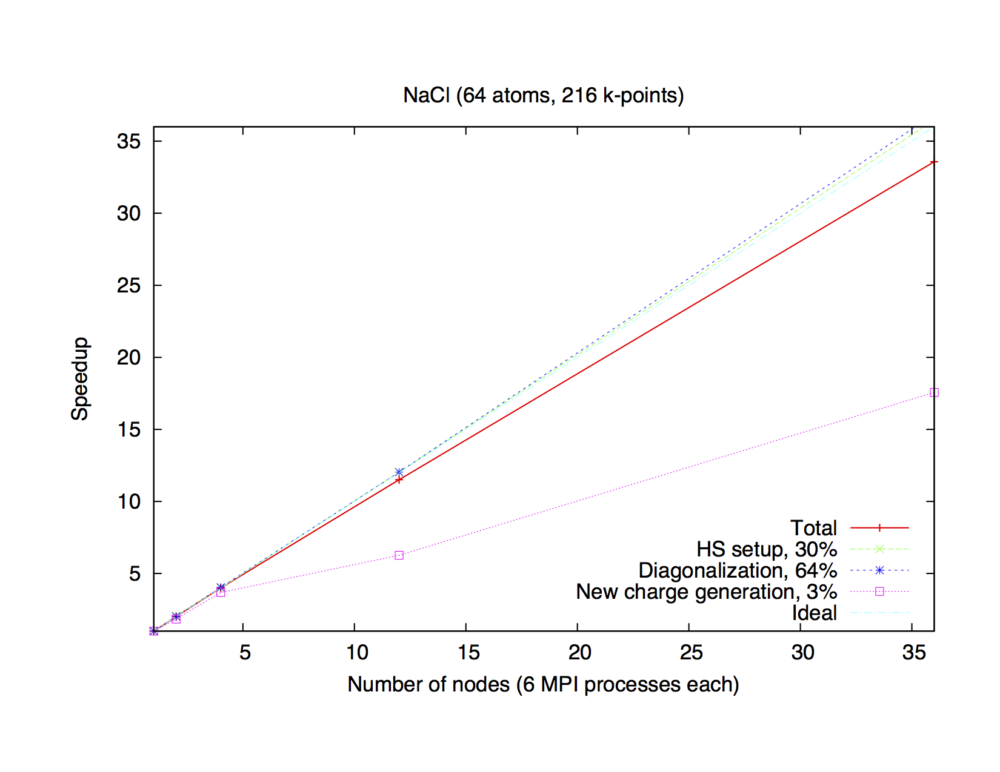
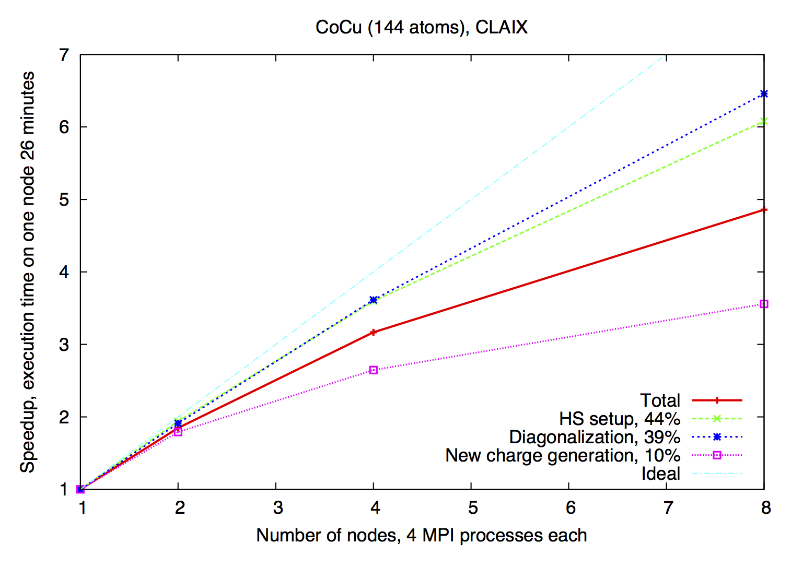
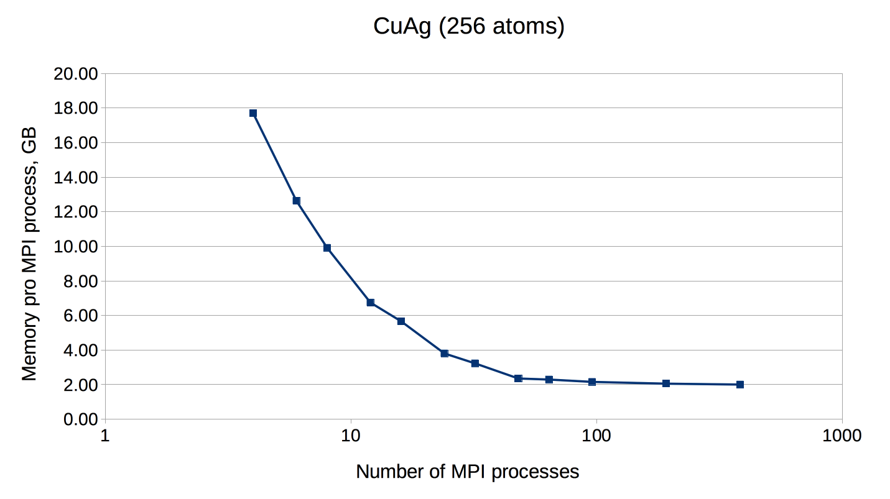
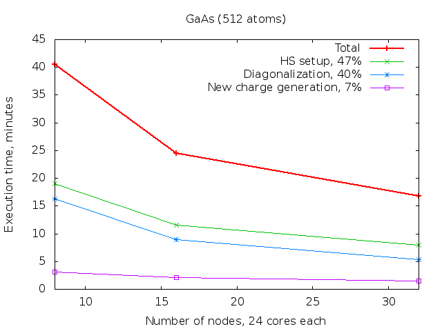

Running Fleur
=================
Here we deal with the question of how to run FLEUR "by hand". If you are interested in running FLEUR in a scripting environment you might want to check the  [AiiDA plug-in](http://aiida-fleur.readthedocs.io/en/develop/).

At first you might notice that there are several executables created in the build process. You might find:

* **inpgen**: The [input generator](inpgen.md) used to construct the full input file for FLEUR
* **fleur** A serial version (i.e. no MPI distributed memory parallelism, multithreading might still be used)
* **fleur_MPI** A parallel version of FLEUR able to run on multiple nodes using MPI.

In most cases you will first run the [input generator](inpgen.md) to create an [inp.xml](xmlio.md) file. Afterwards you will run fleur or fleur_MPI using this inp.xml file.
Please note that fleur/fleur_MPI will always read its setting from an inp.xml file in the current directory.

Command line options
======
The run-time behaviour of FLEUR can be modified using command line switches. You should understand that these switches modify the way FLEUR might operate or in some cases determine what FLEUR actually does. If you want to change the calculation setup you should modify the [inp.xml](xmlio.md) file.

Here we document the most relevant command line options. For a full list of available options, please run 
```
 fleur -h
```

**General options:**

* `-h`: Prints a help listing all command-line options.
* `-check`: Runs only init-part of FLEUR, useful to check if setup is correct.
* `-debugtime`: Prints out all starting/stopping of timers. Can be useful to monitor the progress of the run.
* `-toXML`: Convert an old **inp**-file into the new [inp.xml](xmlio.md) file.


**Options controlling the IO of eigenvectors/values:**
(not all are available if you did not compile with the required libraries)

* `-eig mem`: no IO, all eigenvectors are stored in memory. This can be a problem if you have little memory and many k-points. Default for serial version of FLEUR. ""Only available in serial version of FLEUR.""
* `-eig da`: write data to disk using Fortran direct-access files. Fastest disk IO scheme. *Only available in serial version of FLEUR.*
* `-eig mpi`: no IO, all eigenvectors are stored in memory in a distributed fashion. Uses MPI one-sided communication. Default for MPI version of FLEUR.  *Only available in MPI version of FLEUR.*
* `-eig hdf`: write data to disk using HDF5 library. Can be used in serial and MPI version (if HDF5 is compiled for MPI-IO). 

**Options controlling the Diagonalization:**
(not all are available if you did not compile with the required libraries)

* `-diag lapack`: Use standard LAPACK routines. Default in FLEUR (if not parallel EVP)
* `-diag scalapack`: Use SCALAPACK for parallel EVP.
* `-diag elpa`: Use ELPA for parallel EVP.
* Further options might be available, check `fleur -h` for a list.


Environment Variables
-----------------------
There are basically two environments variables you might want to change when using FLEUR.

### OMP_NUM_THREADS

As FLEUR uses OpenMP it is generally a good idea to consider adjusting OMP_NUM_THREADS to use
all cores available. While this might happen automatically in you queuing system you should check if you use
appropriate values. Check the output of FLEUR to standard out.

So you might want to use `export OMP_NUM_THREADS=2` or something similar.


### juDFT

You can use the juDFT variable to set command line switches that do not require an additional argument. For example

`export juDFT="-diag elpa"`

would run FLEUR with these command line switches.


Hybrid MPI/OpenMP Parallelization
===============
The efficient usage of FLEUR on modern supercomputers is ensured by hybrid MPI/OpenMP parallelization. The k-point loop and the eigenvector problem 
are parallelized via MPI (Message Passing Interface). In addition to that, every MPI process can be executed on several computer cores with shared memory,
using either OpenMP (Open Multi-Processing) interface or multi-threaded libraries.

### MPI parallelization
* The k-point parallelisation gives us increased speed when making calculations with large k-point sets.
* The eigenvector parallelisation gives us an additional speed up but also allows us to tackle larger systems by reducing the amount of memory that we use with each MPI process.

Depending on the specific architecture, one or the other or both levels of parallelization can be used. 

http:/images/Parallel.gif

### k-point Parallelisation 

This type of parallelization is always chosen, if the number of  k-points (K) is a multiple of the number of MPI processes (P). If K/P is not integer, a mixed parallelization will be attempted and M MPI processes will work on a single k-point, so that K.M/P is integer. This type of parallelization 
can be very efficient, because all three most time-consuming parts of the code (Hamiltonian matrix setup, diagonalization and generation of the new charge density) are independent for different k-points and there is no need to communicate during the calculation. That is why this type of parallelization is fine, 
even if the communication between the nodes/processors is slow. The drawback of this type of parallelization is that the whole matrix must fit in the memory 
available for one MPI process, i.e. sufficient memory per MPI process to solve a single eigenvalue-problem for a k-point is required. The scaling is good, 
as long as many k-points are calculated and the potential generation does not get a bottleneck. The saturation of the memory bandwidth might cause the deviation 
of the speedup from the ideal.


 Typical speedup of the k-point parallelization for a small system 
(NaCl, 64 atoms, 216 k-points) on a computer cluster (Intel E5-2650V4, 2.2 GHz). 
Execution time of one iteration is 3 hours 53 minutes.                                                                                                                                                                                                                                                                                                                                                      

### Eigenvector Parallelization                                                                                                                                                                                                                                                        

If the number of  k-points is not a multiple of the number of MPI processes, every k-point will be parallelized over several MPI processes. It might be necessary 
to use this type of parallelization to reduce the memory usage per MPI process, i.e. if the eigenvalue-problem is too large. This type of parallelization depends 
on external libraries which can solve eigen problem on parallel architectures. The FLEUR code contains interfaces to ScaLAPACK, ELPA and Elemental. It is possible 
to use HDF library if needed. 

                                                                                                                           
 Example of eigenvector parallelization of a calculation with 144 atoms on the CLAIX (Intel E5-2650V4, 2.2 GHz).


 An example of FLEUR memory requirements depending on the amount of MPI ranks. 
Test system: CuAg (256 atoms, 1 k-point). Memory usage was measured on 
the CLAIX supercomputer (Intel E5-2650V4, 2.2 GHz, 128 GB per node)

### OpenMP parallelization
Modern HPC systems are usually cluster systems, i.e. they consist of shared-memory computer nodes connected through a communication network. 
It is possible to use the distributed-memory paradigm (that means MPI parallelization) also inside the node, but in this case the memory available 
for every MPI process will be considerably smaller. Imagine you use a node with 24 cores and 120 GB memory. If you start one MPI process it will get 
all 120 GB, two will only get 60 GB and so on, if you start 24 MPI processes, only 5 GB memory will be available for each of them. The intra-node 
parallelism can be utilized more efficiently when using shared-memory programming paradigm, for example OpenMP interface. In the FLEUR code the hybrid 
MPI/OpenMP parallelization is realised either by directly implementing OpenMP pragmas or by usage of multi-threaded libraries. If you want to profit 
from this type of parallelization, you would need ELPA and multithreaded MKL library.


 Timing measurements of the GaAs system (512 atoms) on the CLAIX supercomputer 
(Intel E5-2650V4, 2.2 GHz, 24 cores per node, 128 GB per node).

### Parallel execution: best practices
Since there are several levels of parallelization available in FLEUR: k-point MPI parallelization, eigenvalue MPI parallelization and multi-threaded
parallelization, it is not always an easy decision, how to use the available HPC resources in the most effective way: how many nodes does one need, 
how many MPI processes per node, how many threads per MPI process. First of all, if your system contains several k-point, choose the number of MPI 
processes accordingly. If the number of  k-points (K) is a multiple of the number of MPI processes (P) than every MPI procces will work on a given 
k-point alone. If K/P is not integer, a mixed parallelization will be attempted and M MPI processes will work on a single k-point, so that K.M/P is 
integer. That means for example, that if you have 48 k-points in your system, it is not a good idea to start 47 MPI processes.

The next question is: how many nodes do I need? That depends strongly on the size of the unit cell you simulating and the memory size of the node 
you are simulating on. In the table below you can find some numbers from our experience on a commodity Intel cluster with 120 GB and 24 cores per 
node - if your unit cell (and hardware you use) is similar to what is shown there, it can be a good start point. The two numbers in the "# nodes"-column 
show the range from the "minimum needed" to the "still reasonable". Note that our test systems have only one k-point. If your simulation crashed 
with the run-out-of-memory-message, try to double your requested resources (after having checked that ulimit -s is set unlimited, of course ;)). 
The recommended number of MPI processes per node can be found in the next column. As for the number of OpenMP threads, on the Intel architecture 
it is usually a good idea to fill the node node with the threads (i.e. if the node consist of 24 cores and you start 4 MPI processes, you spawn 
each to 6 threads), but not to use the hyper-threading.

  Best values for some test cases.
  Hardware: Intel Broadwell, 24 cores per node, 120 GB memory.
  
 | Name  | # k-points | real/complex | # atoms | Matrix size   |  LOs  |  # nodes   | # MPI per node |
 | ---   |  ---       |   ---        |   ---   |   ---         |   --- |  ---       |       ---      |
 | NaCl  |      1     |      c       |    64   |     6217      |   -   |     1      |       4        | 
 | AuAg  |      1     |      c       |   108   |    15468      |   -   |     1      |       4        |
 | CuAg  |      1     |      c       |   256   |    23724      |   -   |   1 - 8    |       4        |
 |  Si   |      1     |      r       |   512   |    55632      |   -   |   2 - 16   |       4        |
 | GaAs  |      1     |      c       |   512   |    60391      |   +   |   8 - 32   |       2        |
 | TiO2  |      1     |      c       |   1078  |   101858      |   +   |  16 - 128  |       2        |
 
And last but not least - if you use the node exclusively, bind your processes and check your environment. If the processes are allowed to vagabond 
through the node (which is usually default), the performance can be severely damaged.


