Examples sorted by elements
================

# Hydrogen

**Elemental: **
 
```
H2 molecule with film setup

&input film=t /
    11.50    0.00    0.00
     0.00   11.50    0.00
     0.00    0.00    1.00
     1.00
     1.00    1.00    1.00

      2
  1  0.0     0.0     0.75
  1  0.0     0.0    -0.75

&allatoms jri=183 rmt=0.70 dx=0.042 /

&film dvac=3.72 dtild=4.86/
&comp kmax=4.8 gmax=15.6 gmaxxc=10.7 /
&kpt  nkpt=1 div1=1 div2=1 /
```


Bond-length plot: 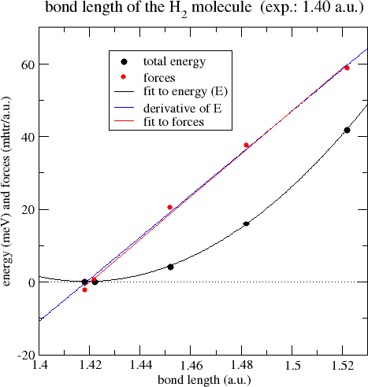
  
**Elemental (delta): **
 
```
Hydrogen (APW+lo used for actual calculation)

&input film=f /

&lattice latsys=hP a0=1.8897269 a=4.00759 c=5.00307 /

4
 1  1.0  2.0  0.17498
 1  2.0  1.0 -0.17498
 1  2.0  1.0 -0.32502
 1  1.0  2.0  0.32502
&factor 3.0 3.0 1.0 /

&atom element="H" rmt=0.65 jri=981 lmax=12 lnonsph=6 /
&comp kmax=5.2 gmaxxc=13.0 gmax=15.5 /
&kpt div1=11 div2=11 div3= 9 tkb=0.0005 /

```
 

**Surfaces:  **
 H / Fe (100)  
 
**Compounds:  **
 
** BH~3~ **
```
Diborane molecule with LDA using film setup

&input film=t /

&lattice latsys="tP" a=15.0 c=5 /

      8
  5  0.0     0.0     1.65000
  5  0.0     0.0    -1.65000
  1  1.88    0.0     0.0
  1 -1.88    0.0     0.0
  1  0.0     1.70    3.0
  1  0.0    -1.70    3.0
  1  0.0     1.70   -3.0
  1  0.0    -1.70   -3.0
&factor 15.0 15.0 1.0/

&atom element="H" jri=221 rmt=0.75 dx=0.038 /

&exco xctyp="pz" /
&comp kmax=4.2 gmax=13.5 gmaxxc=10.0 /
&kpt  nkpt=1 div1=1 div2=1 /
```

Bond-length plot: 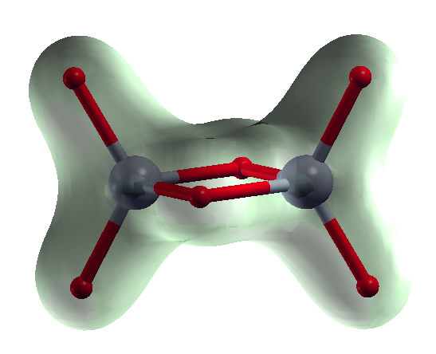

** H~2~O **

Elemental input for H2O (Ice II):

(internal units)
```
H2O (Ice II) from ICSD database 

&input film=f /

&lattice latsys='oC', a0=1.8897269 a=4.5 b=7.8 c=5.56 /

 -4
 8  0.038  0.372  0.072      ! transformed to internal units
 1 -0.167  0.167  0.250      ! since cartesian=f by default
 1  0.250  0.250  0.000
 1  0.205  0.705  0.000

&gen 2
 -1  0  0   0                ! also these are in internal
  0 -1  0   0                ! coordinates (cartesian=f)
  0  0  1  0.5

  0 -1  0   0
 -1  0  0   0
  0  0 -1  0.5 /

&atom element="H" rmt=0.9 /
&atom element="O" rmt=1.5 /

&comp kmax=4.4 gmax=15.0 /
```
   
(scaled cartesian units)   
```
H2O (Ice II) from ICSD database (http://icsd.fiz-karlsruhe.de/)

&input film=f cartesian=t /

&lattice latsys='oC', a0=1.8897269 a=4.5 b=7.8 c=5.56 /

 -4
 8  0.205  0.167  0.072
 1  0.000  0.167  0.250
 1  0.250  0.000  0.000
 1  0.455  0.250  0.000

&gen 2                          ! as in the int. tables
 -1  0  0   0                   ! for C 2 2  2_1
  0 -1  0   0                   ! http://www.cryst.ehu.es 
  0  0  1  0.5

 -1  0  0   0
  0  1  0   0
  0  0 -1  0.5 /

&atom element="H" rmt=0.9 /
&atom element="O" rmt=1.5 /

&comp kmax=4.4 gmax=15.0 /
```

Note, that in the first case all coordinates and symmetry operations are in internal units (w.r.t. the axes of the base-centered orthorhombic lattice), in the second case w.r.t. the (orthogonal) axes of the primitive orthorhombic lattice.

View of the structure: 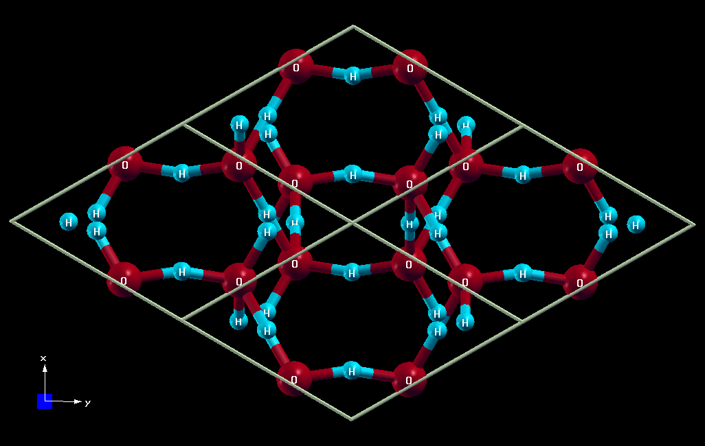


# Helium 


**Elemental (Delta): **
```
hcp Helium

&input film=f /

&lattice latsys=hdp a0=1.8897269 a=2.92661 c=4.77913 /

2
 2  1.0  1.0  1.0
 2 -1.0 -1.0 -1.0
&factor 3.0 3.0 4.0 /

&atom element="He" rmt=2.0 jri=981 lmax=12 lnonsph=6  /
&comp kmax=5.0 gmaxxc=12.5 gmax=15.0 /
&kpt div1=27 div2=27 div3=15 tkb=0.0005 /

```
 
# Lithium


**Elemental (Delta): **
 
 Li 
```
Li

&input film=f /

&lattice latsys='rho' a0=14.437589 alpha=23.22001 /

3
 3   0.     0.    0.
 3   2.     2.    2.
 3   7.     7.    7.
&factor 9. 9. 9. /

&atom element="Li" rmt=2.3 jri=981 lmax=12 lnonsph=6  /
&comp kmax=4.7 gmaxxc=12.5 gmax=15.0 /
&kpt div1=17 div2=17 div3=17 tkb=0.0005 /

```
 

# Beryllium


**Elemental (Delta): **
 

```
hcp Be

&input film=f /

&lattice latsys=hdp a0=1.8897269 a=2.26276 c=3.57316 /

2
 4  1.0  1.0  1.0
 4 -1.0 -1.0 -1.0
&factor 3.0 3.0 4.0 /

&atom element="Be" rmt=2.0 jri=981 lmax=12 lnonsph=6  /
&comp kmax=5.0 gmaxxc=12.5 gmax=15.0 /
&kpt div1=27 div2=27 div3=15 tkb=0.0005 /

```
 


# Boron


**Elemental (Delta) : **
 
 B 
```
B (tricl) (APW+lo used for actual calculation)

&input film=f /

&lattice latsys=aP a0=1.8897269 a=4.90067 b=4.90067 c=5.05098 alpha=119.02035 beta=60.97965 gamma=120 /

12
5.0    0.98969      0.01031      0.67465
5.0    0.01031      0.98969      0.32535
5.0    0.98969      0.65404      0.67465
5.0    0.01031      0.34596      0.32535
5.0    0.34596      0.01031      0.67465
5.0    0.65404      0.98969      0.32535
5.0    0.77885      0.22115      0.07274
5.0    0.22115      0.77885      0.92726
5.0    0.77885      0.63043      0.07274
5.0    0.22115      0.36957      0.92726
5.0    0.36957      0.22115      0.07274
5.0    0.63043      0.77885      0.92726

&atom element="B" rmt=1.5 jri=981 lmax=12 lnonsph=6 /
&comp kmax=4.5 gmaxxc=12.0 gmax=13.5 /
	&kpt div1=10 div2= 10 div3= 6 tkb=0.0005 /
```
 
 

**Compounds:  **
 
 ** BH'_3_' ** [See Hydrogen](#hydrogen)
   


#Carbon

**Graphite**
```
grahite C (APW+lo used for actual calculation)

&input film=f /

&lattice latsys=hP a0=1.8897269 a=2.46857 c=8.84079 /

4
 6  0.0  0.0  0.25
 6  0.0  0.0 -0.25
 6  1.0  2.0  0.25
 6  2.0  1.0 -0.25
&factor 3.0 3.0 1.0 /

&atom element="C" rmt=1.3 jri=981 lmax=12 lnonsph=6 /
&comp kmax=5.2 gmaxxc=13.0 gmax=15.5 /
&kpt div1=16 div2=16 div3= 6 tkb=0.0005 /
```

**Diamond**
```
Diamond

&lattice latsys=cF a=6.74 /

 2
 6  0.125  0.125  0.125 
 6 -0.125 -0.125 -0.125 

&kpt div1=9 div2=9 div3=9 /
```
Bandstructure plot: 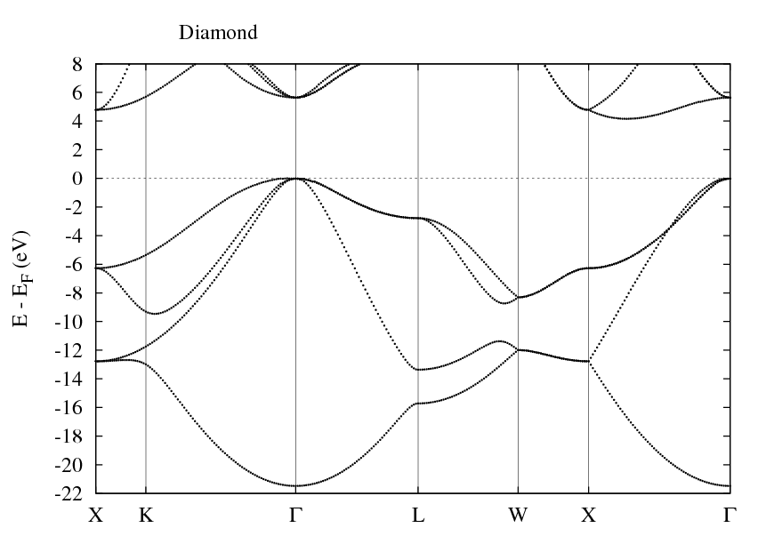


# Nitrogen


**Elemental (Delta): **
 
```
cubic nitrogen (APW+lo used for actual calculation)

&input film=f /

&lattice latsys=cP a0=1.8897269 a=6.19019 /

8
 7   0.05189      0.05189      0.05189
 7   0.94811      0.94811      0.94811
 7   0.44811      0.94811      0.55189
 7   0.55189      0.05189      0.44811
 7   0.94811      0.55189      0.44811
 7   0.05189      0.44811      0.55189
 7   0.55189      0.44811      0.94811
 7   0.44811      0.55189      0.05189

&atom element="N" rmt=1.0 jri=981 lmax=12 lnonsph=6 /
&comp kmax=6.0 gmaxxc=15.0 gmax=18.0 /
&kpt div1= 6 div2= 6 div3= 6 tkb=0.0005 /

```
 
# Oxygen


**Elemental (Delta): **
 
```
monoclinic oxygen (introduce magn. moment with the swsp=T switch!) (APW+lo used for actual calculation)

&input film=f /

&lattice latsys=mP a0=1.8897269 a=4.57148 b=4.27163 c=4.27682 gamma=66.72128 /

4
 8.0   0.14667 0.93782      0            0.14667
 8.0   0.85333 0.06218      0            0.85333
 8.1   0.14667 0.43782      0.50000      0.14667
 8.1   0.85333 0.56218      0.50000      0.85333

&atom element="O" id=8.0 rmt=1.1 jri=981 lmax=12 lnonsph=6  bmu=1.0 /
&atom element="O" id=8.1 rmt=1.1 jri=981 lmax=12 lnonsph=6  bmu=-1.0 /
&comp kmax=6.2 gmaxxc=15.0 gmax=18.0 /
&kpt div1= 4 div2= 4 div3= 4 tkb=0.0005 /

```
 
 
 
**Compounds:  **
 
**H'_2_'O**: [See Hydrogen](#hydrogen)

**TiO'_2_'**: [See Ti](#titanium)

**ZnO**: [See Zn](%zink)

# Fluorine


**Elemental (Delta): **
```
F (mC) (APW+lo used for actual calculation)

&input film=f cartesian=F  /

&lattice latsys=mA a0=1.8897269 a=6.92543 b=6.16310 c=3.68505 gamma=96.77538 /

 4
 9 0.09413 -0.0753 0.5853
 9 0.90587  0.0753 0.4147
 9 0.40587  0.4147 0.0753
 9 0.59413 -0.4147 0.9247

&atom element="F" rmt=1.3 jri=981 lmax=12 lnonsph=6 /
&comp kmax=5.0 gmaxxc=12.5 gmax=15.0 /
&kpt div1=10 div2= 10 div3= 6 tkb=0.0005 /

```
 

# Neon


**Elemental (Delta): **
 
```
fcc Ne

&input film=f /

&lattice latsys=cF a0=1.8897269 a=4.62262 /

1
10 0.0 0.0 0.0

&atom element="Ne" rmt=2.2 jri=981 lmax=12 lnonsph=6 /
&comp kmax=5.0 gmaxxc=12.5 gmax=15.0 /
&kpt div1=15 div2=15 div3=15 tkb=0.0005 /

```
 


# Sodium


**Elemental (Delta): **
 
 Na 
```
Na

&input film=f /

&lattice latsys='rho' a0=17.797693  alpha=22.92203 /

3
11   0.     0.    0.
11   2.     2.    2.
11   7.     7.    7.
&factor 9. 9. 9. /

&atom element="Na" rmt=2.4 jri=981 lmax=12 lnonsph=6 lo="2s 2p" /
&comp kmax=4.7 gmaxxc=12.5 gmax=15.0 /
&kpt div1=15 div2=15 div3=15 tkb=0.0005 /

```
 

# Magnesium


**Elemental (Delta): **
 
```
hcp Mg

&input film=f /

&lattice latsys=hdp a0=1.8897269 a=3.19405 c=5.17198 /

2
12  1.0  1.0  1.0
12 -1.0 -1.0 -1.0
&factor 3.0 3.0 4.0 /

&atom element="Mg" rmt=2.3 jri=981 lmax=12 lnonsph=6 lo="2p" /
&comp kmax=5.0 gmaxxc=12.5 gmax=15.0 /
&kpt div1=27 div2=27 div3=15 tkb=0.0005 /

```
 


# Aluminum


**Elemental (Delta): **
 
```
fcc aluminum

&input film=f /

&lattice latsys=cF a0=1.8897269 a=4.04021 /

1
13 0.0 0.0 0.0

&atom element="Al" rmt=2.3 jri=981 lmax=12 lnonsph=6  /
&comp kmax=5.0 gmaxxc=12.5 gmax=15.0 /
&kpt div1=17 div2=17 div3=17 tkb=0.0005 /

```
 


# Silicon


**Elemental (Delta): **
 
```
alpha Si

&input film=f /

&lattice latsys=cF a0=2.67247737973 a=3.86709 /

2
14  0.125  0.125  0.125
14 -0.125 -0.125 -0.125

&atom element="Si" rmt=2.1 jri=981 lmax=12 lnonsph=6  /
&comp kmax=5.0 gmaxxc=12.5 gmax=15.0 /
&kpt div1=17 div2=17 div3=17 tkb=0.0005 /

```
 


# Phosphorus

Black Phosphorus

**Elemental (Delta): **
```
P  (oC)

&input film=f cartesian=T /

&lattice latsys=oC a0=1.8897269 a=3.30466 b=11.31694 c=4.57327 /

 4
   15      0            0.09357      0.08719
   15      0            0.90643      0.91281
   15      0            0.40643      0.58719
   15      0            0.59357      0.41281

&atom element="P" rmt=2.0 jri=981 lmax=12 lnonsph=6 /
&comp kmax=5.5 gmaxxc=13.5 gmax=16.0 /
&kpt div1=20 div2= 6 div3=14 tkb=0.0005 /
```

**scaled cartesian units**
Note, that all coordinates and symmetry operations are in internal units w.r.t. the (orthogonal) axes of the primitive orthorhombic lattice.


```
P (black) from ICSD database (http://icsd.fiz-karlsruhe.de/)

&input film=f cartesian=t /

&lattice latsys='oC', a0=1.8897269 a=3.3199 b=10.3678 c=4.3154 /

 -1
15  0.0000 0.1044 0.0821

&gen 2                          ! as in the int. tables
 -1  0  0 -0.5                  ! for C m c a (64)
  0 -1  0  0.5                  ! http://www.cryst.ehu.es 
  0  0  1  0.5                  ! but for primitive unit cell

 -1  0  0   0  
  0 -1  0   0
  0  0 -1   0 /

&comp kmax=4.0 gmax=15.0 /
```

The following plot visualizes the bonding in phosphorus:
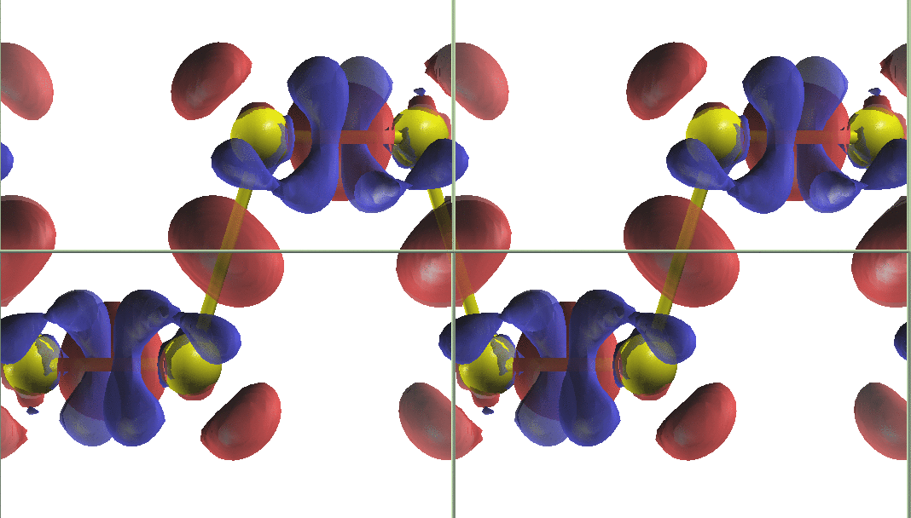

#Sulfur

**Elemental (Delta): **
```
S

&input film=f /

&lattice latsys='rho' a0=4.8783866 alpha=91.45541 /

1
16   0.  0. 0.

&atom element="S" rmt=2.3 jri=981 lmax=12 lnonsph=6 /
&comp kmax=5.0 gmaxxc=12.5 gmax=15.0 /
&kpt div1=25 div2=25 div3=25 tkb=0.0005 /
```


# Chlorine


**Elemental (Delta): **
 
```
Cl (o)

&input film=f cartesian=T /

&lattice latsys=oC a0=1.8897269 a=7.77875 b=4.34941 c=9.02754 /

 4
   17      0            0.40882      0.89848
   17      0            0.09118      0.39848
   17      0            0.90882      0.60152
   17      0            0.59118      0.10152

&atom element="Cl" rmt=1.8 jri=981 lmax=12 lnonsph=6 /
&comp kmax=5.0 gmaxxc=12.5 gmax=15.0 /
&kpt div1= 6 div2= 10 div3= 4 tkb=0.0005 /

```
 


# Argon


**Elemental (Delta): **
 
```
fcc Ar

&input film=f /

&lattice latsys=cF a0=1.8897269 a=5.95059 /

1
18 0.0 0.0 0.0

&atom element="Ar" rmt=2.5 jri=981 lmax=12 lnonsph=6 /
&comp kmax=4.5 gmaxxc=11.0 gmax=13.5 /
&kpt div1=15 div2=15 div3=15 tkb=0.0005 /

```
 
# Potasium


**Elemental (Delta): **
 
```
bcc potassium

&input film=f /

&lattice latsys=cI a0=1.8897269 a=5.28589 /

1
19 0.0 0.0 0.0

&atom element="K" rmt=2.5 jri=981 lmax=12 lnonsph=6 lo="3s 3p" /
&comp kmax=4.5 gmaxxc=11.0 gmax=12.5 /
&kpt div1=19 div2=19 div3=19 tkb=0.0005 /

```


# Calcium


**Elemental (Delta): **
 
```
fcc Ca

&input film=f /

&lattice latsys=cF a0=1.8897269 a=5.52507 /

1
20     0.0 0.0 0.0

&atom element="Ca" rmt=2.4 jri=981 lmax=12 lnonsph=6 lo="3s 3p" /
&comp kmax=5.0 gmaxxc=12.5 gmax=15.0 /
&kpt div1=21 div2=21 div3=21 tkb=0.0005 /

```


# Scandium


**Elemental (Delta): **
 
```
hcp Scandium

&input film=f /

&lattice latsys=hdp a0=1.8897269 a=3.32145 c=5.16192 /

2
21  1.0  1.0  1.0
21 -1.0 -1.0 -1.0
&factor 3.0 3.0 4.0 /

&atom element="Sc" rmt=2.3 jri=981 lmax=12 lnonsph=6 lo="3s 3p" /
&comp kmax=5.0 gmaxxc=12.5 gmax=15.0 /
&kpt div1=27 div2=27 div3=15 tkb=0.0005 /

```


==========
TiInps
============
# Titanium


**Elemental (Delta) : **
```
hcp Titanium

&input film=f /

&lattice latsys=hdp a0=1.8897269 a=2.93664 c=4.65193 /

2
22  1.0  1.0  1.0
22 -1.0 -1.0 -1.0
&factor 3.0 3.0 4.0 /

&atom element="Ti" rmt=2.1 jri=981 lmax=12 lnonsph=6 lo="3s 3p" /
&comp kmax=5.2 gmaxxc=12.5 gmax=15.0 /
&kpt div1=31 div2=31 div3=17 tkb=0.0005 /
```

**Alternative:**
```
Ti

&input film=f cartesian=f /

&lattice latsys='hcp' a0=5.57 a=1.0 c=1.588 /

 2                         ! number of atoms
 22   1.000000  2.000000  1.000000      ! Z,positions
 22   2.000000  1.000000 -1.000000      ! Z,positions
&factor 3.0 3.0 4.0    /
```

Bandstructure-plot: 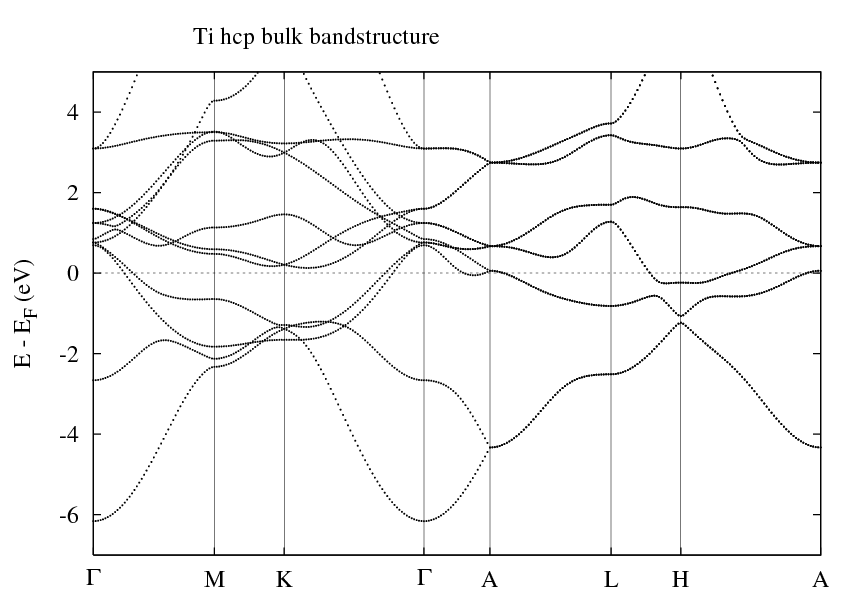
 
**Compounds:**
 
**TiO'_2_'**:
```
TiO2 Rutile

&input film=f /

&lattice latsys='tP' a0=1.8897269 a=4.594 c=2.959 /

-2
22 0.0 0.0 0.0
 8 0.306 0.306 0.0

&gen 3
 -1  0  0  0.0
  0 -1  0  0.0
  0  0 -1  0.0

 -1  0  0  0.5
  0  1  0  0.5
  0  0 -1  0.5

  0 -1  0  0.5
  1  0  0  0.5
  0  0  1  0.5
```

The structure looks like this: 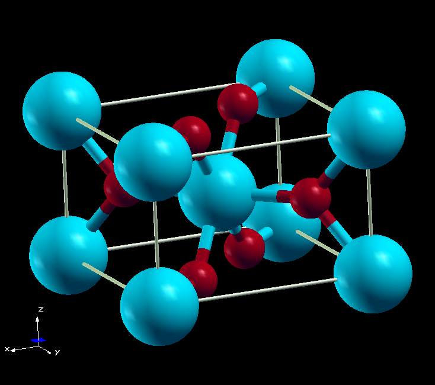


# Vanadium

**Elemental (Delta): **
 
```
bcc V

&input film=f /

&lattice latsys=cI a0=1.8897269 a=2.99894 /

1
23     0.0 0.0 0.0

&atom element="V" rmt=2.1 jri=981 lmax=12 lnonsph=6 lo="3s 3p" /
&comp kmax=5.2 gmaxxc=12.5 gmax=15.0 /
&kpt div1=31 div2=31 div3=31 tkb=0.0005 /

```


# Chromium


**Elemental (Delta): **
 
```
bcc Cr

&input film=f /

&lattice latsys=cP a0=1.8897269 a=2.87100 /

2
24.0   0.0 0.0 0.0
24.1   0.5 0.5 0.5

&atom element="Cr" id=24.0 rmt=2.1 jri=981 lmax=12 lnonsph=6 lo="3s 3p" bmu=1.5 /
&atom element="Cr" id=24.1 rmt=2.1 jri=981 lmax=12 lnonsph=6 lo="3s 3p" bmu=-1.5 /
&comp kmax=5.2 gmaxxc=12.5 gmax=15.0 /
&kpt div1=24 div2=24 div3=24 tkb=0.0005 /

```


# Manganese


**Elemental (Delta): **
  
```
tet manganese

&input film=f /

&lattice latsys=tP a0=1.8897269 a=2.5424166 c=3.59552 /

2
25.1   0.0 0.0 0.0
25.2   0.5 0.5 0.5

&atom element="Mn" id=25.1 rmt=2.1 jri=981 lmax=12 lnonsph=6 lo="3s 3p" bmu=2.3 /
&atom element="Mn" id=25.2 rmt=2.1 jri=981 lmax=12 lnonsph=6 lo="3s 3p" bmu=-2.3 /
&comp kmax=5.2 gmaxxc=13.0 gmax=15.5 /
&kpt div1=28 div2=28 div3=20 tkb=0.0005 /

```


# Iron

**Elemental (Delta): **
 
```
bcc Fe

&input film=f /

&lattice latsys=cI a0=1.8897269 a=2.83351 /

1
26     0.0 0.0 0.0

&atom element="Fe" rmt=2.1 jri=981 lmax=12 lnonsph=6 lo="3s 3p" /
&comp kmax=5.2 gmaxxc=12.5 gmax=15.0 /
&kpt div1=27 div2=27 div3=27 tkb=0.0005 /
```

**Elemental (fcc-structure): **
```
Fe fcc in Cu lattice constant

&input film=f /

&lattice latsys='cF' a0=6.82 /

1
26 0.0 0.0 0.0
```

# Cobalt

**Elemental (Delta): **
 
```
hcp Cobalt

&input film=f /

&lattice latsys=hdp a0=1.8897269 a=2.49680 c=4.03081 /

2
27  1.0  1.0  1.0
27 -1.0 -1.0 -1.0
&factor 3.0 3.0 4.0 /

&atom element="Co" rmt=2.2 jri=981 lmax=12 lnonsph=6 lo="3p" /
&comp kmax=5.0 gmaxxc=12.5 gmax=15.0 /
&kpt div1=25 div2=25 div3=15 tkb=0.0005 /

```


# Nickel


**Elemental (Delta): **
  
```
fcc Ni

&input film=f /

&lattice latsys=cF a0=1.8897269 a=3.52414 /

1
28 0.0 0.0 0.0

&atom element="Ni" rmt=2.2 jri=981 lmax=12 lnonsph=6 lo="3p" /
&comp kmax=5.0 gmaxxc=12.5 gmax=15.0 /
&kpt div1=25 div2=25 div3=25 tkb=0.0005 /

```


# Copper

**Elemental (Delta): **
```
fcc copper

&input film=f /

&lattice latsys=cF a0=1.8897269 a=3.63689 /

1
29 0.0 0.0 0.0

&atom element="Cu" rmt=2.28 jri=981 lmax=12 lnonsph=6 /
&comp kmax=5.0 gmaxxc=12.5 gmax=15.0 /
&kpt div1=25 div2=25 div3=25 tkb=0.0005 /
```

** Alternative**
```
Cu bulk

&input film=f /

&lattice latsys='cF' a=6.82 /

 1
 29 0.0 0.0  0.0

&comp kmax=4.0 /
&kpt div1=13 div2=13 div3=13 /
```

Fermi-surface: 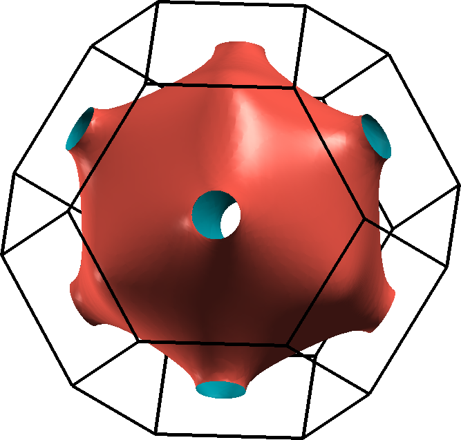

**(111)-Surface**
```
Cu (111) 7 layers

&input film=t /

&lattice latsys='hP' a=4.824 c=10.0 /

 7
 29 0.0 0.0  3.0
 29 1.0 2.0  2.0
 29 2.0 1.0  1.0
 29 0.0 0.0  0.0
 29 1.0 2.0 -1.0
 29 2.0 1.0 -2.0 
 29 0.0 0.0 -3.0
&factor 3.0 3.0 0.2538071 /

&kpt div1=13 div2=13 div3=1 /
```
Bandstructure-plot: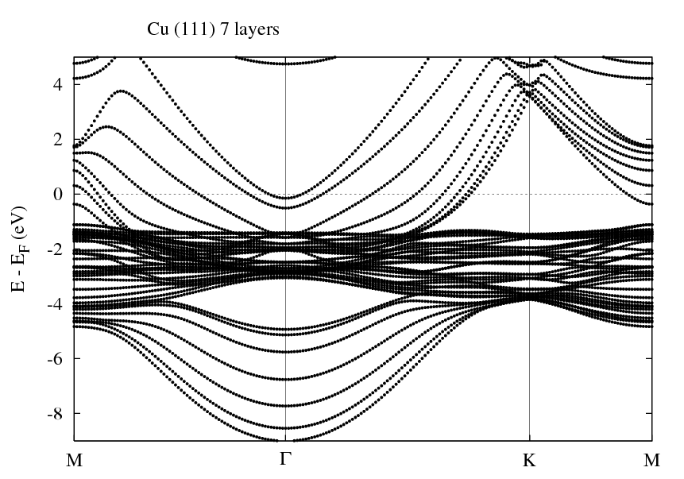

# Zinc

**Elemental (Delta): **
```
hcp Zinc

&input film=f /

&lattice latsys=hdp a0=1.8897269 a=2.66169 c=5.00397 /

2
30  1.0  1.0  1.0
30 -1.0 -1.0 -1.0
&factor 3.0 3.0 4.0 /

&atom element="Zn" rmt=2.4 jri=981 lmax=12 lnonsph=6  lo="3d" econfig="[Ne] 3s2 3p6 | 3d10 4s2" /
&comp kmax=4.7 gmaxxc=12.0 gmax=14.0 /
&kpt div1=17 div2=17 div3=13 tkb=0.0005 /
```

** Alternative**
```
Zn bulk

&input inistop=t oldfleur=f cartesian=f /

&lattice latsys='hcp' a0=5.0267 a=1.0 c=1.856 /

 2                         ! number of atoms
 30   1.000000  2.000000  0.250000      ! Z,positions
 30   2.000000  1.000000 -0.250000      ! Z,positions
&factor 3.0 3.0 1.0    
```

 
**Compounds:**
 
**ZnO**:
```
ZnO (Wurtzite)

&input inistop=t oldfleur=f cartesian=f /

&lattice latsys='hcp' a=6.14 c=9.828 /

 4                         ! number of atoms
 30   1.000000  2.000000  0.000000      ! Z,positions
 30   2.000000  1.000000  0.500000      ! Z,positions
  8   1.000000  2.000000  0.382300      ! Z,positions
  8   2.000000  1.000000  0.882300      ! Z,positions
&factor 3.0 3.0 1.0    /
```

Bandstructure-plot: 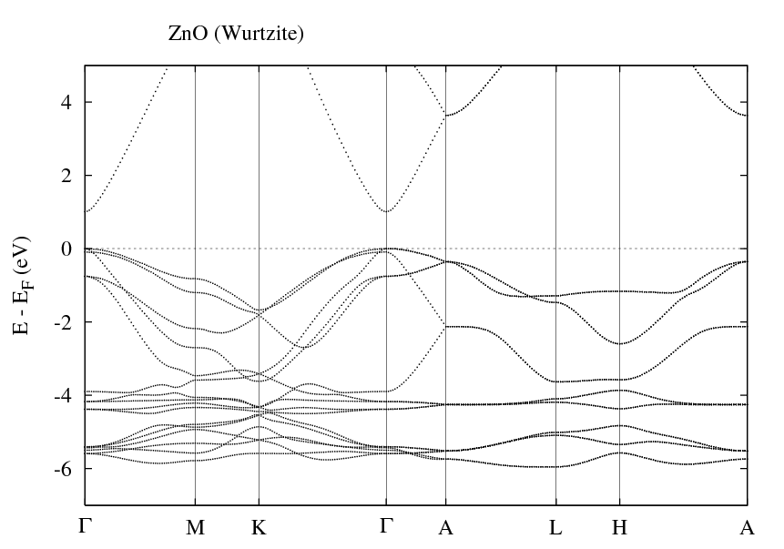

# Gallium


**Elemental (Delta): **
 
 Ga 
```
Gallium(o)

&input film=f cartesian=T  /

&lattice latsys=oC a0=1.8897269 a=4.56689 b=7.75330 c=4.59978 /

 4
   31      0            0.15642      0.08120
   31      0            0.84358      0.91880
   31      0            0.34358      0.58120
   31      0            0.65642      0.41880

&atom element="Ga" rmt=2.3 jri=981 lmax=12 lnonsph=6  lo="3d" /
&comp kmax=5.0 gmaxxc=12.5 gmax=15.0 /
&kpt div1=12 div2= 8 div3=12 tkb=0.0005 /

```


# Germanium


**Elemental (Delta): **
 
```
alpha Ge

&input film=f /

&lattice latsys=cF a0=2.67247737973 a=4.07419 /

2
32  0.125  0.125  0.125
32 -0.125 -0.125 -0.125

&atom element="Ge" rmt=2.3 jri=981 lmax=12 lnonsph=6  lo="3d" /
&comp kmax=5.0 gmaxxc=12.5 gmax=15.0 /
&kpt div1=17 div2=17 div3=17 tkb=0.0005 /

```


# Arsenic

**Elemental (Delta): **
 
```
As

&input film=f /

&lattice latsys='rho' a0=7.9729138 alpha=53.843117 /

2
33   0.22657  0.22657  0.22657
33  -0.22657 -0.22657 -0.22657

&atom element="As" rmt=2.3 jri=981 lmax=12 lnonsph=6  lo="3d" /
&comp kmax=5.0 gmaxxc=12.5 gmax=15.0 /
&kpt div1=13 div2=13 div3=13 tkb=0.0005 /

```


# Selenium


**Elemental (Delta): **
 
```
Selenium

&input film=f symor=T /

&lattice latsys=hP a0=1.8897269 a=4.52464 c=5.04978 /

3
 34    0.21903      0            0.33333333333
 34    0            0.21903      0.66666666667
 34    0.78097      0.78097      0.0

&atom element="Se" rmt=2.2 jri=981 lmax=12 lnonsph=6  lo="3d" /
&comp kmax=5.0 gmaxxc=12.5 gmax=15.0 /
&kpt div1= 9 div2= 9 div3= 6 tkb=0.0005 /

```


# Bromium


**Elemental (Delta): **
 
```
Bromium(o)

&input film=f cartesian=T /

&lattice latsys=oC a0=1.8897269 a=8.22860 b=4.22731 c=9.03323 /

 4
   35      0            0.37574      0.88284
   35      0            0.12426      0.38284
   35      0            0.87574      0.61716
   35      0            0.62426      0.11716

&atom element="Br" rmt=2.1 jri=981 lmax=12 lnonsph=6  lo="3d" /
&comp kmax=5.0 gmaxxc=12.5 gmax=15.0 /
&kpt div1= 4 div2= 8 div3= 4 tkb=0.0005 /

```


# Krypton


**Elemental (Delta): **
 
```
fcc Kr

&input film=f /

&lattice latsys=cF a0=1.8897269 a=6.4293 /

1
36 0.0 0.0 0.0

&atom element="Kr" rmt=2.5 jri=981 lmax=12 lnonsph=6 /
&comp kmax=4.5 gmaxxc=11.0 gmax=13.5 /
&kpt div1=15 div2=15 div3=15 tkb=0.0005 /

```


# Rubidium 


**Elemental (Delta): **
 
```
bcc rubidium

&input film=f /

&lattice latsys=cI a0=1.8897269 a=5.67197 /

1
37 0.0 0.0 0.0

&atom element="Rb" rmt=2.5 jri=981 lmax=12 lnonsph=6 lo="4s 4p" /
&comp kmax=4.5 gmaxxc=11.0 gmax=12.5 /
&kpt div1=19 div2=19 div3=19 tkb=0.0005 /

```
 


# Strontium


**Elemental (Delta): **
 
```
fcc strontium

&input film=f /

&lattice latsys=cF a0=1.8897269 a=6.01969 /

1
38 0.0 0.0 0.0

&atom element="Sr" rmt=2.4 jri=981 lmax=12 lnonsph=6 lo="4s 4p" /
&comp kmax=5.0 gmaxxc=12.5 gmax=15.0 /
&kpt div1=21 div2=21 div3=21 tkb=0.0005 /

```
 


# Yttrium


**Elemental (Delta): **
  
```
hcp Y

&input film=f /

&lattice latsys=hdp a0=1.8897269 a=3.66051 c=5.67399 /

2
39  1.0  1.0  1.0
39 -1.0 -1.0 -1.0
&factor 3.0 3.0 4.0  /

&atom element="Y" rmt=2.3 jri=981 lmax=12 lnonsph=6 lo="4s 4p" /
&comp kmax=5.0 gmaxxc=12.5 gmax=15.0 /
&kpt div1=25 div2=25 div3=15 tkb=0.0005 /

```
 

# Zirconium

**Elemental (Delta): **
 
```
hcp Zirconium

&input film=f /

&lattice latsys=hdp a0=1.8897269 a=3.23603 c=5.18953 /

2
40  1.0  1.0  1.0
40 -1.0 -1.0 -1.0
&factor 3.0 3.0 4.0 /

&atom element="Zr" rmt=2.3 jri=981 lmax=12 lnonsph=6 lo="4s 4p" /
&comp kmax=5.0 gmaxxc=12.5 gmax=15.0 /
&kpt div1=25 div2=25 div3=15 tkb=0.0005 /

```
 


# Niobium


**Elemental (Delta): **
 
```
bcc Niobium

&input film=f /

&lattice latsys=cI a0=1.8897269 a=3.32239 /

1
41 0.0 0.0 0.0

&atom element="Nb" rmt=2.3 jri=981 lmax=12 lnonsph=6 lo="4s 4p" /
&comp kmax=5.0 gmaxxc=12.5 gmax=15.0 /
&kpt div1=25 div2=25 div3=25 tkb=0.0005 /

```
 

# Molybdenum


**Elemental (Delta): **
 
```
bcc Molybdenum

&input film=f /

&lattice latsys=cI a0=1.8897269 a=3.16930 /

1
42 0.0 0.0 0.0

&atom element="Mo" rmt=2.3 jri=981 lmax=12 lnonsph=6 lo="4s 4p" /
&comp kmax=5.0 gmaxxc=12.5 gmax=15.0 /
&kpt div1=25 div2=25 div3=25 tkb=0.0005 /

```
 


# Tecnetium


**Elemental (Delta): **
 
```
hcp Technetium

&input film=f /

&lattice latsys=hdp a0=1.8897269 a=2.76187 c=4.41905 /

2
43  1.0  1.0  1.0
43 -1.0 -1.0 -1.0
&factor 3.0 3.0 4.0 /

&atom element="Tc" rmt=2.2 jri=981 lmax=12 lnonsph=6 lo="4s 4p" /
&comp kmax=5.0 gmaxxc=12.5 gmax=15.0 /
&kpt div1=25 div2=25 div3=15 tkb=0.0005 /

```
 


# Ruthenium


**Elemental (Delta): **
 
```
hcp Ruthenium

&input film=f /

&lattice latsys=hdp a0=1.8897269 a=2.72661 c=4.30050 /

2
44  1.0  1.0  1.0
44 -1.0 -1.0 -1.0
&factor 3.0 3.0 4.0 /

&atom element="Ru" rmt=2.2 jri=981 lmax=12 lnonsph=6 lo="4p" /
&comp kmax=5.0 gmaxxc=12.5 gmax=15.0 /
&kpt div1=25 div2=25 div3=15 tkb=0.0005 /

```
 


# Rhodium


**Elemental (Delta): **
 
```
fcc rhodium

&input film=f /

&lattice latsys=cF a0=1.8897269 a=3.84210 /

1
45 0.0 0.0 0.0

&atom element="Rh" rmt=2.2 jri=981 lmax=12 lnonsph=6 lo="4p" /
&comp kmax=5.0 gmaxxc=12.5 gmax=15.0 /
&kpt div1=25 div2=25 div3=25 tkb=0.0005 /

```
 


# Palladium


**Elemental (Delta): **
 
```
fcc palladium

&input film=f /

&lattice latsys=cF a0=1.8897269 a=3.95315 /

1
46 0.0 0.0 0.0

&atom element="Pd" rmt=2.3 jri=981 lmax=12 lnonsph=6 lo="4p" /
&comp kmax=5.0 gmaxxc=12.5 gmax=15.0 /
&kpt div1=25 div2=25 div3=25 tkb=0.0005 /

```
 


# Silver


**Elemental (Delta): **
 
```
fcc silver

&input film=f /

&lattice latsys=cF a0=1.8897269 a=4.16424 /

1
47 0.0 0.0 0.0

&atom element="Ag" rmt=2.3 jri=981 lmax=12 lnonsph=6 lo="4s 4p" /
&comp kmax=5.0 gmaxxc=12.5 gmax=15.0 /
&kpt div1=25 div2=25 div3=25 tkb=0.0005 /

```
 


# Cadmium


**Elemental (Delta): **
```
hcp Cadmium

&input film=f /

&lattice latsys=hdp a0=1.8897269 a=3.03716 c=5.77061 /

2
48  1.0  1.0  1.0
48 -1.0 -1.0 -1.0
&factor 3.0 3.0 4.0 /

&atom element="Cd" rmt=2.5 jri=981 lmax=12 lnonsph=6  lo="4d"  econfig="[Ar] 4s2 3d10 4p6 | 4d10 5s2" /
&comp kmax=4.7 gmaxxc=12.0 gmax=14.0 /
&kpt div1=17 div2=17 div3=13 tkb=0.0005 /

```
 


# Indium


**Elemental (Delta): **
```
bct In

&input film=f /

&lattice latsys=tI a0=1.8897269 a=3.29841 c=5.06256 /

1
49     0.0 0.0 0.0

&atom element="In" rmt=2.4 jri=981 lmax=12 lnonsph=6  lo="4d" /
&comp kmax=5.0 gmaxxc=12.5 gmax=15.0 /
&kpt div1=17 div2=17 div3=13 tkb=0.0005 /

```
 


# Tin


**Elemental (Delta): **
 
```
alpha Sn

&input film=f /

&lattice latsys=cF a0=1.8897269 a=6.6559537 /

2
50  0.125  0.125  0.125
50 -0.125 -0.125 -0.125

&atom element="Sn" rmt=2.3 jri=981 lmax=12 lnonsph=6  lo="4d" /
&comp kmax=5.0 gmaxxc=12.5 gmax=15.0 /
&kpt div1=17 div2=17 div3=17 tkb=0.0005 /

```
 


# Antimony


**Elemental (Delta): **
 
```
Sb

&input film=f /

&lattice latsys='rho' a0=8.6669374 alpha=57.051774 /

2
51   0.23332  0.23332  0.23332
51  -0.23332 -0.23332 -0.23332

&atom element="Sb" rmt=2.4 jri=981 lmax=12 lnonsph=6  lo="4d" /
&comp kmax=5.0 gmaxxc=12.5 gmax=15.0 /
&kpt div1=13 div2=13 div3=13 tkb=0.0005 /

```
 

# Tellurium


**Elemental (Delta): **
 
```
hex Te

&input film=f symor=T /

&lattice latsys=hP a0=1.8897269 a=4.50788 c=5.96346 /

3
 52    0.26966      0            0.33333333333
 52    0            0.26966      0.66666666667
 52    0.73034      0.73034      0.0

&atom element="Te" rmt=2.4 jri=981 lmax=12 lnonsph=6  lo="4d" /
&comp kmax=5.0 gmaxxc=12.5 gmax=15.0 /
&kpt div1= 9 div2= 9 div3= 5 tkb=0.0005 /

```
 


# Iodine


**Elemental (Delta): **
 
```
Iodine (o)

&input film=f  /

&lattice latsys=oP a0=1.8897269 a=8.57701 b=4.55422 c=10.18381 /

 8
   53      0            0.36410      0.87857
   53      0            0.13590      0.37857
   53      0            0.86410      0.62143
   53      0            0.63590      0.12143
   53      0.50000      0.86410      0.87857
   53      0.50000      0.63590      0.37857
   53      0.50000      0.36410      0.62143
   53      0.50000      0.13590      0.12143

&atom element="I" rmt=2.4 jri=981 lmax=12 lnonsph=6  lo="4d" /
&comp kmax=5.0 gmaxxc=12.5 gmax=15.0 /
&kpt div1= 8 div2=10 div3= 6 tkb=0.0005 /

```
 


# Xenon


**Elemental (Delta): **
 
```
fcc Xe

&input film=f /

&lattice latsys=cF a0=1.8897269 a=7.05482 /

1
54 0.0 0.0 0.0

&atom element="Xe" rmt=2.5 jri=981 lmax=12 lnonsph=6  lo="4d" /
&comp kmax=4.5 gmaxxc=11.5 gmax=13.5 /
&kpt div1=15 div2=15 div3=15 tkb=0.0005 /

```
 


# Caesium


**Elemental (Delta): **
 
```
bcc Cs

&input film=f /

&lattice latsys=cI a0=1.8897269 a=6.16153 /

1
55 0.0 0.0 0.0

&atom element="Cs" rmt=2.4 jri=981 lmax=12 lnonsph=6 lo="5s 5p" /
&comp kmax=4.5 gmaxxc=11.5 gmax=13.5 /
&kpt div1=25 div2=25 div3=25 tkb=0.0005 /

```
 
 


# Barium


**Elemental (Delta): **
 
```
bcc barium

&input film=f /

&lattice latsys=cI a0=1.8897269 a=5.02792 /

1
56 0.0 0.0 0.0

&atom element="Ba" rmt=2.4 jri=981 lmax=12 lnonsph=6 lo="5s 5p" /
&comp kmax=5.0 gmaxxc=12.5 gmax=15.0 /
&kpt div1=25 div2=25 div3=25 tkb=0.0005 /

```
 
 
# Hafnium


**Elemental (Delta): **
 
```
hcp Hafnium

&input film=f /

&lattice latsys=hdp a0=1.8897269 a=3.20273 c=5.06493 /

2
72  1.0  1.0  1.0
72 -1.0 -1.0 -1.0
&factor 3.0 3.0 4.0 /

&atom element="Hf" rmt=2.3 jri=981 lmax=12 lnonsph=6 lo="4f 5s 5p" /
&comp kmax=5.0 gmaxxc=12.5 gmax=15.0 /
&kpt div1=25 div2=25 div3=15 tkb=0.0005 /

```
 
 


# Tantalum


**Elemental (Delta): **
 
```
bcc tantalum

&input film=f /

&lattice latsys=cI a0=1.8897269 a=3.32169 /

1
73 0.0 0.0 0.0

&atom element="Ta" rmt=2.3 jri=981 lmax=12 lnonsph=6 lo="4f 5s 5p" /
&comp kmax=5.0 gmaxxc=12.5 gmax=15.0 /
&kpt div1=25 div2=25 div3=25 tkb=0.0005 /

```
 
 

**Compounds:  **
 
**Ta'_2_'D**:

```
Ta2D  from ICSD database (http://icsd.fiz-karlsruhe.de/)  #61486 

&input film=f cartesian=t /

&lattice latsys='oA', a0=1.8897269 a=4.67 b=4.67 c=3.303 /

 -2
73 0.2624 0.25 0.25             ! A-centered setting like in #28022
 1 0.000  0.00 0.00             ! use H for D

&gen 2                          ! as in the int. tables
 -1  0  0   0.0                 ! for C 2 2 2
  0 -1  0   0.0                 ! http://www.cryst.ehu.es 
  0  0  1   0.0

 -1  0  0   0.0
  0  1  0   0.0
  0  0 -1   0.0 /               ! we leave out the translation 

&atom element="Ta" lo=5p   /
&exco xctyp="pz" /
&comp kmax=4.0 gmax=12.0 /
```

This is a simple example of an A-centered orthorhombic lattice.


# Tungsten


**Elemental (Delta): **
 
```
bcc tungsten

&input film=f /

&lattice latsys=cI a0=1.8897269 a=3.18968 /

1
74 0.0 0.0 0.0

&atom element="W" rmt=2.3 jri=981 lmax=12 lnonsph=6 lo="5s 5p" /
&comp kmax=5.0 gmaxxc=12.5 gmax=15.0 /
&kpt div1=25 div2=25 div3=25 tkb=0.0005 /

```
 


# Rhenium


**Elemental (Delta): **
 
```
hcp Re

&input film=f /

&lattice latsys=hdp a0=1.8897269 a=2.77447 c=4.47993 /

2
75  1.0  1.0  1.0
75 -1.0 -1.0 -1.0
&factor 3.0 3.0 4.0 /

&atom element="Re" rmt=2.3 jri=981 lmax=12 lnonsph=6 lo="5s 5p" /
&comp kmax=5.0 gmaxxc=12.5 gmax=15.0 /
&kpt div1=25 div2=25 div3=15 tkb=0.0005 /

```
 
 


# Osmium


**Elemental (Delta): **
 
```
hcp Osmium

&input film=f /

&lattice latsys=hdp a0=1.8897269 a=2.75895 c=4.35694 /

2
76  1.0  1.0  1.0
76 -1.0 -1.0 -1.0
&factor 3.0 3.0 4.0 /

&atom element="Os" rmt=2.3 jri=981 lmax=12 lnonsph=6 lo="5p" /
&comp kmax=5.0 gmaxxc=12.5 gmax=15.0 /
&kpt div1=25 div2=25 div3=15 tkb=0.0005 /

```
 
 


# Iridium


**Elemental (Delta): **
 
```
fcc iridium

&input film=f /

&lattice latsys=cF a0=1.8897269 a=3.87675 /

1
77 0.0 0.0 0.0

&atom element="Ir" rmt=2.3 jri=981 lmax=12 lnonsph=6 lo="5p" /
&comp kmax=5.0 gmaxxc=12.5 gmax=15.0 /
&kpt div1=25 div2=25 div3=25 tkb=0.0005 /

```
 
 


# Platinum


**Elemental (Delta): **
 
```
fcc platinum

&input film=f /

&lattice latsys=cF a0=1.8897269 a=3.97675 /

1
78 0.0 0.0 0.0

&atom element="Pt" rmt=2.3 jri=981 lmax=12 lnonsph=6 lo="5p" /
&comp kmax=5.0 gmaxxc=12.5 gmax=15.0 /
&kpt div1=25 div2=25 div3=25 tkb=0.0005 /

```
 
 


# Gold


**Elemental (Delta): **
 
```
fcc gold

&input film=f /

&lattice latsys=cF a0=1.8897269 a=4.17410 /

1
79 0.0 0.0 0.0

&atom element="Au" rmt=2.3 jri=981 lmax=12 lnonsph=6 /
&comp kmax=5.0 gmaxxc=12.5 gmax=15.0 /
&kpt div1=25 div2=25 div3=25 tkb=0.0005 /

```
 
 


# Mercury


**Elemental (Delta): **
 
```
bct Hg

&input film=f /

&lattice latsys=tI a0=1.8897269 a=4.10305 c=3.54831 /

1
80     0.0 0.0 0.0

&atom element="Hg" rmt=2.3 jri=981 lmax=12 lnonsph=6  lo="5p 5d" econfig="[Kr] 5s2 4d10 4f14 | 5p6 5d10 6s2" /
&comp kmax=5.0 gmaxxc=12.5 gmax=15.0 /
&kpt div1=19 div2=19 div3=19 tkb=0.0005 /

```
 
 


# Thallium


**Elemental (Delta): **
```
hcp Tl

&input film=f /

&lattice latsys=hdp a0=1.8897269 a=3.59255 c=5.64195 /

2
81  1.0  1.0  1.0
81 -1.0 -1.0 -1.0
&factor 3.0 3.0 4.0 /

&atom element="Tl" rmt=2.3 jri=981 lmax=12 lnonsph=6  lo="5d" /
&comp kmax=5.0 gmaxxc=12.5 gmax=15.0 /
&kpt div1=19 div2=19 div3=13 tkb=0.0005 /

```
 
 


# Lead


**Elemental (Delta): **
```
fcc Pb

&input film=f /

&lattice latsys=cF a0=1.8897269 a=5.04386 /

1
82 0.0 0.0 0.0

&atom element="Pb" rmt=2.3 jri=981 lmax=12 lnonsph=6  lo="5d" /
&comp kmax=5.0 gmaxxc=12.5 gmax=15.0 /
&kpt div1=25 div2=25 div3=25 tkb=0.0005 /

```
 
 


# Bismuth


**Elemental (Delta): **
 
 Bi 
```
rho Bi

&input film=f /

&lattice latsys='rho' a0=9.1623962 alpha=56.484592 /

2
83   0.23374  0.23374  0.23374
83  -0.23374 -0.23374 -0.23374

&atom element="Bi" rmt=2.4 jri=981 lmax=12 lnonsph=6  lo="5d" /
&comp kmax=5.0 gmaxxc=12.5 gmax=15.0 /
&kpt div1=13 div2=13 div3=13 tkb=0.0005 /
```
 
 
**Elemental: **
 
``` 
Bi rhl {exp lattice constant, 2 atom unit cell}
 
&input inistop=t oldfleur=f /
 
&lattice latsys='rho'  a0=8.976, alpha=57.23 /
 
  2                             ! number of atoms
 83    0.263941  0.263941   0.263941  ! Z,positions
 83   -0.263941 -0.263941  -0.263941  ! Z,positions

&soc 0.0 0.0
```
 
Bandstructure: 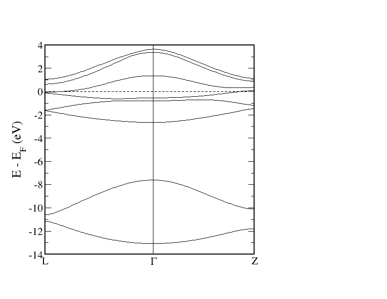


# Polonium


**Elemental (Delta): **
 
 
```
cub Po
&input film=f /
&lattice latsys=cP a0=1.8897269 a=3.34818 /

1
84 0.0 0.0 0.0

&atom element="Po" rmt=2.4 jri=981 lmax=12 lnonsph=6 lo="5d" econfig="[Xe] 4f14 | 5d10 6s2 6p4" /
&comp kmax=5.0 gmaxxc=12.5 gmax=15.0 /
&kpt div1=24 div2=24 div3=24 /

```
 
 


# Ytterbium

Elemental input:
```
Yb fcc bulk 

&lattice latsys='cF' a0=1.8897269 a=5.49 /

1
70    0.0 0.0 0.0

&atom element=Yb rmt=2.5 econfig='[Kr] 4d10 | 4f14 5s2 5p6 6s2' lo=5s5p /
&comp kmax=3.5 /
 
```

We treat the 5s and 5p states as local orbitals and the 4f with LDA+U

density matrix file: n_mmp_mat
```
 1.9703395169836     0.0000000000000     0.0000000000000     0.0000000000000     0.0000000000000     0.0000000000000     0.0000000000000
     0.0000000000000    -0.0014408308808     0.0000000000000     0.0000000000000     0.0000000000000     0.0000000000000     0.0000000000000
     0.0000000000000     0.0000000000000     1.9678035740164     0.0000000000000     0.0000000000000     0.0000000000000     0.0000000000000
     0.0000000000000     0.0000000000000     0.0000000000000     0.0043960476423     0.0000000000000     0.0000000000000     0.0000000000000
     0.0000000000000     0.0000000000000     0.0000000000000     0.0000000000000     1.9710835588552     0.0000000000000     0.0000000000000
     0.0000000000000     0.0000000000000     0.0000000000000     0.0000000000000     0.0000000000000    -0.0014408308808     0.0000000000000
     0.0000000000000     0.0000000000000     0.0000000000000     0.0000000000000     0.0000000000000     0.0000000000000     1.9692234541878
     0.0000000000000     0.0000000000000     0.0000000000000     0.0000000000000     0.0000000000000     0.0000000000000     0.0000000000000
    -0.0014408308808     0.0000000000000     0.0000000000000     0.0000000000000     0.0000000000000     0.0000000000000     0.0000000000000
     0.0000000000000     1.9710835588552     0.0000000000000     0.0000000000000     0.0000000000000     0.0000000000000     0.0000000000000
     0.0000000000000     0.0000000000000     0.0043960476423     0.0000000000000     0.0000000000000     0.0000000000000     0.0000000000000
     0.0000000000000     0.0000000000000     0.0000000000000     1.9678035740164     0.0000000000000     0.0000000000000     0.0000000000000
     0.0000000000000     0.0000000000000     0.0000000000000     0.0000000000000    -0.0014408308808     0.0000000000000     0.0000000000000
     0.0000000000000     0.0000000000000     0.0000000000000     0.0000000000000     0.0000000000000     1.9703395169836     0.0000000000000
```


In this way the lattice constant is approximated quite reasonably:
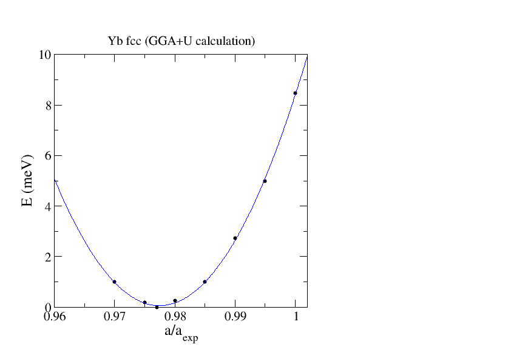

Density of states:
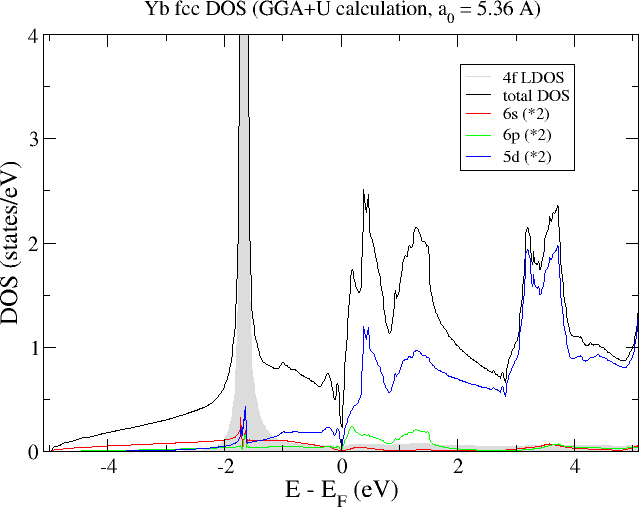


# Lutetium


**Elemental: **
 
```
hcp Lu

&input film=f /

&lattice latsys=hdp a0=1.8897269 a=3.52388 c=5.48025 /

2
71  1.0  1.0  1.0
71 -1.0 -1.0 -1.0
&factor 3.0 3.0 4.0 /

&atom element="Lu" rmt=2.3 jri=981 lmax=12 lnonsph=6 lo="4f 5s 5p"  econfig="[Kr] 4d10 | 4f14 5s2 5p6 5d1 6s2" /
&comp kmax=5.0 gmaxxc=12.5 gmax=15.0 /
&kpt div1=25 div2=25 div3=15 tkb=0.0005 /

```
 


# Proactinium


**Elemental: **
```
Pa fcc bulk

&input film=f /

&lattice latsys='cF' a=8.7643 /

 1
 91 0.0 0.0  0.0

&atom element='Pa' econfig='[Xe] 4f14 5d10 6s2 | 6p6 5f2 6d1 7s2' lo=6p /

&kpt div1=13 div2=13 div3=13 /
```

