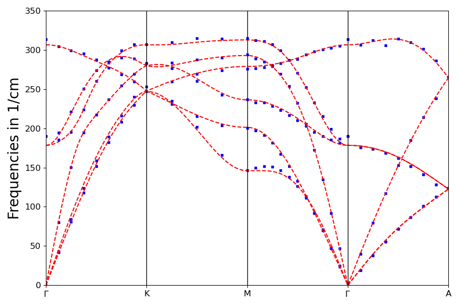

# The FLEUR phonon cookbook

This short document serves as a guide to use FLEUR to generate phonon spectra from scratch. It highlights the necessary preliminaries, how to generate FD spectra in conjunction with the phonopy code and how to use FLEUR's DFPT capability to generate phonon data. A short section on current limitations/future developments is also given.

It will require a workstation, where FLEUR and phonopy are both installed and working. Either have that or run the phonopy specific steps (they need barely any computational effort) on a home PC with modern python.

# Ground-state calculation

First, set up an input file for inpgen. In this case we make one for fcc copper and call it ```inpCu```. It looks as follows:

```
Cu fcc

0.0 1.0 1.0 ! a1
1.0 0.0 1.0 ! a2
1.0 1.0 0.0 ! a3
6.650896828 ! aa
0.5 0.5 0.5 ! scale

1 ! num atoms
29.1 0.0 0.0 0.0

&atom element="Cu" id=29.1 lmax=9 lnonsph=7 jri=981 /
&comp kmax=4.5 gmax=15.0 gmaxxc=15.0 /
&exco xctyp='vwn' /
&kpt div1=16 div2=16 div3=16 tkb=0.0005 /
```

This is a bit more complex than the basic FLEUR input, because it has some comments as flags and a structure, that makes it readable by phonopy. We therefore don't need to reformulate it for the second step.

Now, run inpgen:
```
$ /path/to/inpgen -f inpCu
```

Ensure several things in the resulting inp.xml:
- set ```ctail="F"```
- reduce ```radius``` in ```mtSphere```by a slight margin
- set the iteration count high enough.
- set ```name``` in ```xcFunctional``` to that of an LDA functional available in libxc; optimally, you directly set (e.g. for vwn):
```
      <xcFunctional name="LibXC" relativisticCorrections="F">
         <LibXCName  exchange="lda_x" correlation="lda_c_vwn"/>
      </xcFunctional>
```

Now you need to optimize your input. Converge it too a minimal energy w.r.t. the lattice constant, cutoff parameters, and (in the case of more complex systems) atomic positions. This is why the MT radius was set lower, so the spheres do not crash into each other when reducing the lattice size. For this optimization, invoke FLEUR repeatedly

```
$ /path/to/fleur
```

and fit the lattice dependent energy curve to the Birch-Murnaghan equation of states for example.

Once you are satisfied with your optimization, write a new input file (e.g. inpCu_fit) and fill it with the parameters you converged to. This will be your base input for the follow up calculations.

# Finite displacement calculations

Make a subfolder ```FD``` and copy the optimized input file to it. Now it is time to invoke phonopy. 

```
$ phonopy --fleur -c inpCu_fit -d --dim="2 0 0 0 2 0 0 0 2" --amplitude=0.006
```

This will generate a 2x2x2 supercell with an atomic displacement of one atom by roughly a thousandth of the unit cell size. Other options for the supercell matrix and the amplitude are of course viable as well. In the case of more complex systems, phonopy will spit out several supercell-001 files. We only need to concern ourselves with one for now, as, by symmetry, one displacement already captures the complete response behaviour of the system. Run the generated input file through inpgen:

```
$ /path/to/inpgen -f supercell-001.in
```

Check, that all the parameters you converged are properly set in the new ```inp.xml```. If so, run a gorund-state calculation for the supercell:

```
$ /path/to/fleur
```

Now, set the tags ```l_F="T"``` and ```f_level="0"``` (the second one can also be 1,2,3 for additional corrective force components) to run a force calculation for the system. The relevant output you want is the ```FORCES_SORT``` file. Once you have it, invoke phonopy with:

```
$ phonopy --fleur -f FORCES_SORT
```

In the case of several displacements, one would list:

```
$ phonopy --fleur -f FORCES_SORT_001 FORCES_SORT_002 FORCES_SORT_003 ...
```

This generates the FORCE_SETS file, enabling our final output calls. For a phonon high-symmetry path of Gamma-X-X'(-K)-Gamma-L, given in units of 1/cm, set:

```
$ phonopy --fleur -c inpCu_fit --dim="2 0 0 0 2 0 0 0 2" -p --band="0 0 0 0 1/2 1/2 1/2 1/2 1 0 0 0 1/2 1/2 1/2" --factor=5140.48767176083
```

If all went well, a picture should pop up, looking something like this:


# Density-functional perturbation theory

Make a subfolder DFPT and copy the optimized input file to it. Now you invoke the inpgen several different times to gain the necessary input for the phonon calculation:

```
$ /path/to/fleur/inpgen -f inpCu_fit
$ /path/to/fleur/inpgen -f inpCu_fit -nosym -add_name desym
$ /path/to/fleur/inpgen -inp.xml -noKsym -kpt dfpt#gamma@grid=16,16,16
$ /path/to/fleur/inpgen -inp.xml -noKsym -add_name desym -kpt dfpt#gamma@grid=16,16,16
```

Edit both ```inp.xml``` and ```desym_inp.xml``` to reflect all the changes in the initial input file, like the setting of ```ctail``` etc. Especially ensure, that you use the same libxc functional you used initially, e.g. ```vwn```:

```
      <xcFunctional name="LibXC" relativisticCorrections="F">
         <LibXCName  exchange="lda_x" correlation="lda_c_vwn"/>
      </xcFunctional>
```

Then invoke FLEUR once to generate a ground state solution:

```
$ /path/to/fleur
```

Re-edit ```*inp.xml```. Set ```numbands="all"``` in ```cutoffs``` and ```<kPointListSelection listName="dfpt"/>``` in ```bzIntegration```. Now, you want to specify the DFPT setup in ```inp.xml``` only. In the provided k-point grid of 16x16x16, any q-point in steps of 1/16 is available for calculation. In general, q always has to be the difference between to vectors of the k-set, baring a shift by a complete reciprocal unit vector. In this case, we set

```
      <juPhon l_dfpt="T">
         <qVectors>
            <q> 0.0/16 0.0/16 0.0/16 </q>
            <q> 0.0/16 1.0/16 1.0/16 </q>
            <q> 0.0/16 2.0/16 2.0/16 </q>
            <q> 0.0/16 3.0/16 3.0/16 </q>
            <q> 0.0/16 4.0/16 4.0/16 </q>
            <q> 0.0/16 5.0/16 5.0/16 </q>
            <q> 0.0/16 6.0/16 6.0/16 </q>
            <q> 0.0/16 7.0/16 7.0/16 </q>
            <q> 0.0/16 8.0/16 8.0/16 </q>
            <q> 7.0/16 7.0/16 14.0/16 </q>
            <q> 6.0/16 6.0/16 12.0/16 </q>
            <q> 5.0/16 5.0/16 10.0/16 </q>
            <q> 4.0/16 4.0/16 8.0/16 </q>
            <q> 3.0/16 3.0/16 6.0/16 </q>
            <q> 2.0/16 2.0/16 4.0/16 </q>
            <q> 1.0/16 1.0/16 2.0/16 </q>
            <q> 1.0/16 1.0/16 1.0/16 </q>
            <q> 2.0/16 2.0/16 2.0/16 </q>
            <q> 3.0/16 3.0/16 3.0/16 </q>
            <q> 4.0/16 4.0/16 4.0/16 </q>
            <q> 5.0/16 5.0/16 5.0/16 </q>
            <q> 6.0/16 6.0/16 6.0/16 </q>
            <q> 7.0/16 7.0/16 7.0/16 </q>
            <q> 8.0/16 8.0/16 8.0/16 </q>
         </qVectors>
      </juPhon>
```

somewhere in the ```output``` section, e.g. after ```plotting```. Now make a backup subfolder, copy everything in, and then invoke FLEUR:

```
$ /path/to/fleur
```

The programm will run self-consistency calculations for each q-point provided, each atom and each Cartesian direction and result in a set of ```dynMat*``` files. This gives us phonon frequencies for a rough q-point path of Gamma-X|X'-Gamma-L. With some python code, we can produce a nice plot that overlays the data from both methods:


# Current limitations/State of the art

The development of FLAPW-DFPT in FLEUR has been and still is a lengthy process. There have been both numerical and conceptional hurdles to overcome, that led to quite a lot of finetuning and added corrections or reformulations. 

Currently, the implementation is at the level of polyatomic metals. I.e., we tested monoatomic insulators and metals, silicon diamond as a two-atomic semiconductor and the magnetic metals bcc Fe and fcc Ni. We thus verified, that the calculation holds for more than one atom and more than one spin. However, for hcp Co we see kinks that distinguish the DFPT data from the phonopy curves especially on the Gamma-point. This indicates a problem in the description of terms with the eigenenergy response or the occupation number reponse, both of which are only relevant for more than one atom and the latter only so for materials with fractional occupation numbers. The latter also depend on the former. The DFPT data is plotted against a 4x4x4 supercell FD calculation.



Another current benchmark is the dispersion of Silicon Carbide. It is a test case for polyatomic materials with different atoms, to exclude the possibility of leftover bugs in relation to atomic indices. The DFPT data is plotted against a 2x2x2 supercell FD calculation.


The match for the acoustic branches is as neat as in cobalt, but this time we completely miss a point at Gamma for the optical modes and they deviate quite strongly from the FD line overall. This is possibly a first case, where a system needs the non-analytical term correction, though we were of the mind, that this only applies for polar materials. Further investiagtions need to be done.

A point of contention are local orbitals to supplement the LAPW basis. In force calculations, i.e. a first order description, local obitals are completely contained up to the derivative of their matching coefficients. Doing the same in the DFPT scheme breaks the calculation and we adopt the apporach of not perturbing the LO basis functions.

Another issue is the inclusion of core tail corrections. There is an option to explicitly contain their perturbation for forces by going to ```f_level=1``` and an analogous scheme was developed for the DFPT-FLAPW formalism. However, during testing we found a symmetry breaking caused by the correction, so we disabled it for the time being.

As of yet, FLEUR-DFPT has no implementation of GGA functionals, non-collinear magnetism, spin-orbit coupling, and DFT+U. 